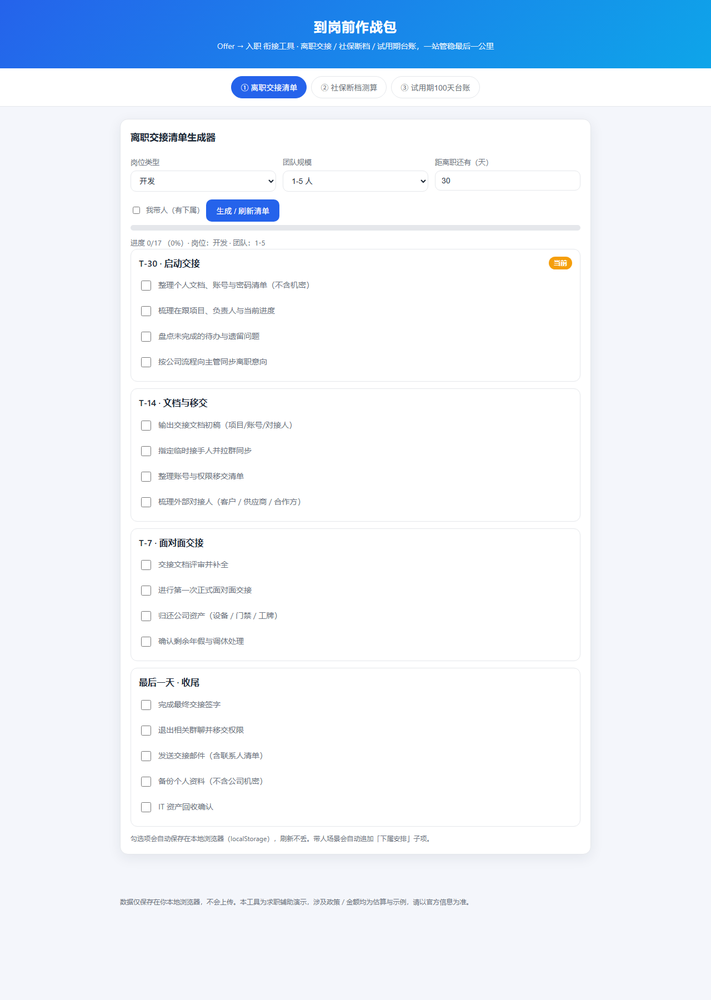
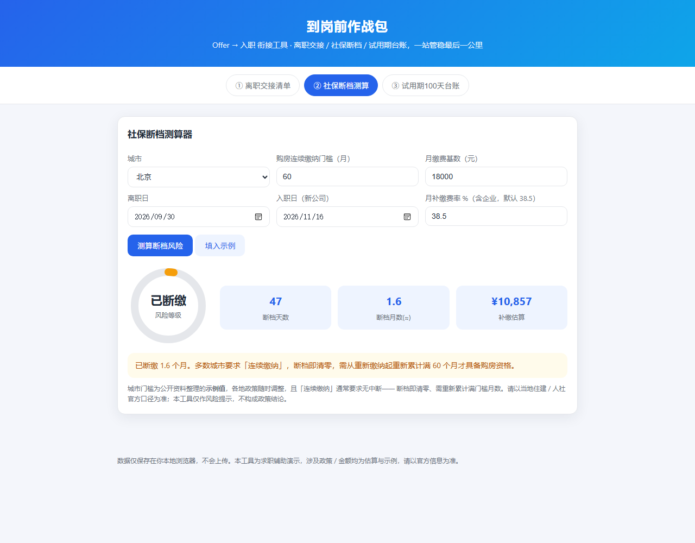

# 到岗前作战包 · Offer → 入职 衔接工具

> 求职工具都在教你「怎么拿 offer」，没人管你「拿到之后怎么不翻车」。
> 这是一个纯前端的「最后一公里」管家 v2.0：**撤离交接 · 断档预警 · 登陆台账**，一站管稳。

## 在线体验

**https://reserendipity.github.io/offer-landing-kit/**

支持直达链接：

- `?tab=handover` — 撤离清单
- `?tab=social&demo=1` — 断档预警（自动填入示例：北京，断档 2 个整月）
- `?tab=probation&demo=1` — 登陆台账（自动填入示例：入职日为 30 天前）

## 它解决什么

| 模块 | 场景 | 能力 |
|---|---|---|
| ① 撤离清单生成器 | 离职交接总漏项，怕背锅 | 按岗位 / 团队规模 / 是否带人 **三维差异化**生成 T-30 集结 / T-14 移交 / T-7 交底 / D-Day 撤离 四阶段任务卡；开发 / 测试 / 产品 / 设计 / 运营各有专属条目；可一键打印成纸质清单 |
| ② 社保断档预警 | 断档影响购房 / 落户资格 | **整月断档 + 月内衔接**专业口径：边界月可确认（离职当月原公司缴 / 入职当月新公司缴）、月历可视化断档区间、大数字呈现断档月数与补缴估算、按门槛月数给风险等级 |
| ③ 试用期 100 天台账 | 试用期摸不清节奏 | 5 个里程碑（第 1 周 / 30 / 60 / 90 / 100 天），每个里程碑配 **4 条可勾选行动项**，自动标注已过 / 临近 / 未到，转正答辩提前预警 |

页首全局状态条：距入职天数 / 断档风险 / 下一里程碑倒计时，三模块数据联动（入职日一处填写全局同步）。

## v2.0 亮点

- **作战简报暗色视觉**：深炭底 + 琥珀预警主色 + 等宽数字排版 + 网格纹理，勾选进度 100% 有「MISSION COMPLETE」彩蛋
- **社保引擎 v2**：从「按自然日折算」升级为「整月断档 + 月内 15 号节点衔接」口径，边界月交由用户确认，更经得起内行推敲
- **清单真个性化**：岗位选择真正改变清单内容（如开发岗追加「代码仓库与分支权限回收」「线上值班告警移交」）
- **台账可执行**：里程碑从「正确的废话」变成 4 条可勾选的具体行动项

## 截图

**断档预警**（示例：北京，断档 2 个整月 → 琥珀「已断缴」+ 月历条可视化）

**登陆台账**（里程碑 + 行动项 + 三色状态徽章）

## 本地数据

所有用户数据（撤离清单勾选进度、入职日、断档测算输入等）只保存在浏览器 localStorage（键前缀 `dzb2_`），零依赖、不上传任何服务端。

- **撤离清单勾选进度按条目稳定 id 存储**（键形如 `dzb2_h_T30_c-t30-1`）：修改条目的展示文案后重新打开页面，已保存的勾选进度仍然保留。
- 旧版本曾以条目文本哈希作键；升级后首次读取时会自动把旧键的值一次性迁移到 id 键并删除旧键，老用户无需操作。
- 影响边界：反之，若在迭代中更换条目的 **id**（而非文案），该条目的勾选进度会丢失；浏览器清除站点数据同样会使全部进度归零。新增条目时请分配不与旧 id 重复的稳定标识。

## 免责声明

社保城市门槛与费率为公开信息整理的**示例值**，各地政策随时调整且差异极大，落户 / 车牌等场景门槛不同，请以当地住建 / 人社官方口径为准。多数城市规定补缴不计入连续缴纳年限。本工具仅作风险提示，不构成政策结论。

## 社保断档测算改动核对

断档结果影响落户 / 购房判断，改动 `index.html` 的断档引擎（`calcSocial` 及边界月口径）前后，请按 [`docs/social-gap-check.md`](docs/social-gap-check.md) 重跑一次最小核对：机械部分执行 `node tools/check-social-gap.mjs`，浏览器部分从演示直达 `?tab=social&demo=1` 进入、按用例表（固定日期）逐项比对断档月数 / 自然日 / 补缴估算 / 风险等级，含入职早于离职的异常分支。该文档只记录验证步骤与不变式，不改变上文的业务口径。

## 开发过程

作品由 AI Agent 结对开发与迭代：v1 → v2 完成视觉重塑与引擎升级；随后一轮 AI 代码审查发现勾选状态错位、台账整块重渲染等真实缺陷，逐项修复并补齐 OG 元信息、打印回退与无障碍属性。

## Changelog

- **v2.0** (2026-09-21)：作战简报暗色视觉重塑；社保引擎升级为月粒度 + 月内衔接口径 + 月历可视化；交接清单岗位×带人×规模三维差异化；台账里程碑配行动项；三模块数据联动 + 全局状态条；打印支持
- **v1.0** (2026-09-20)：首个可用版本（三模块 + localStorage）

## License

Apache-2.0 © 2026 ReSerendipity
